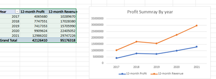
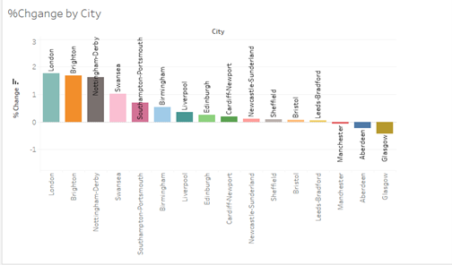
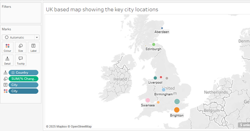
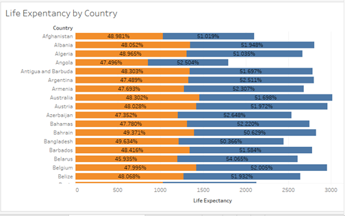
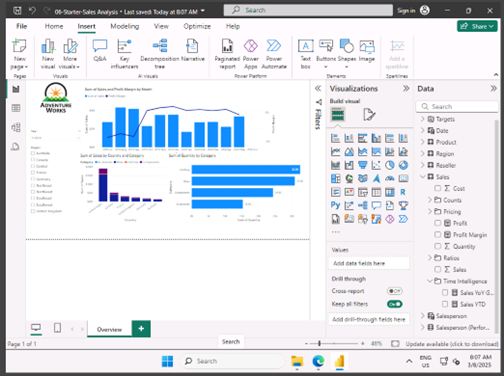

# WorkBooks
# 1. Week1 _Data _Excel
# ✅Legal Frameworks for Handling Data:
| Law/Regulation | What is it? | Importance | Real-world Application | Impact on Data Work | Breach Consequences |
|----------------|-------------|------------|-------------------------|---------------------|----------------------|
| **Data Protection Act** | UK law regulating personal data | Ensures privacy and lawful use | Maintain transparency and security | Affects recruitment and record-keeping | Data loss, legal consequences |
| **GDPR** | EU-wide regulation on personal data | Enhances user control and trust | Assign a Data Protection Officer | Covers both automated/manual data | Hefty fines and penalties |
| **Freedom of Information Act** | Public access to government info | Increases transparency | Only applies to public institutions | Allows public requests for data | Criminal offence if info is hidden |
| **Computer Misuse Act** | UK law against cybercrime | Prohibits unauthorized access | Don't hack/edit without permission | Secures systems/data integrity | Fines and/or imprisonment |

---
## 📊 Day 2: Tasks 1–3

### 🗂 Task 1: Excel Table & Formulas
- Created a table Employee
- Used `FILTER` on Age (largest to smallest)
- Applied `SUM` in L10 for commission total
- Used `AVERAGE` in L11 for commission average
---
### 🧮 Task 2: Student Data Analysis
- Found highest scores in Maths and Science
- Calculated average and max scores
- Identified best student by average and top score
- Applied conditional formatting

### 🧠 Task 3: Excel Practice with Functions
- Used:
  - `SUM`, `SUMIF`, `SUMIFS`
  - `AVERAGE`, `AVERAGEIF`, `AVERAGEIFS`
  - `COUNT`, `COUNTIF`, `COUNTIFS`
  - Logical functions: `IF`, `IFS`, `SWITCH`, `FLOOR`
  - Lookup formulas: `VLOOKUP`, `XLOOKUP`
  - Date formulas
---
## 📈 Day 3: Tasks 1–3

### 📌 Task 1: Pivot Table with Bike Sales
- Explored market sales by:
  - Country (e.g., Germany)
  - Age and Gender
  - Found profitable segments
  
### 📊 Task 2: Sales Volume Analysis
- Dataset: County-wise product sales
- Created Pivot Table by County and Product
- Used `SWITCH` formula to categorize sales as:
  - High (>600), Medium (300–600), Low (<300)

### 📉 Task 3: Visualisation Lab
- Worked with bike sales data
- Built charts for better understanding
- Explored chart types and visual storytelling
---
Please see below chart shows profit summary by Year

---
## 🎤 Day 4: Task 1 – Presenting to Board
- **Delivery Prep**:
  - Plan thoroughly
  - Set milestones
  - Clear communication
- **Tools for Presentation**:
  - Tableau, Power BI, Excel, PowerPoint, GitHub AI
- **Prospecting**:
  - Understand stakeholders and data
- **Public Speaking Tips**:
  - Know your data
  - Build executive presence
- **What to Present**:
  - Key insights and visuals
- **Change Articulation**:
  - Show data gaps and improvement strategies
---

## ✅ What I have learned from Week1 

- Gained foundational knowledge of UK data regulations (DPA, GDPR, FOIA, CMA)
- Applied key Excel formulas and functions for data analysis
- Built and interpreted pivot tables and visualizations
- Understood how to structure and deliver business insights effectively
- Learned presentation techniques for senior stakeholders
- Explored data categorization and summarization methods

---
## 📘 Week 2 Tableau and Power BI Summary
---
# 📊 Tableau Fundamentals

#🚀 What is Tableau?
Tableau is a powerful data visualization tool used for converting raw data into interactive, understandable dashboards and reports.

# 💡 Key Features:
- Drag-and-drop interface
- Real-time data analytics
- Connects to various data sources (Excel, SQL, cloud platforms)
- Dashboard creation and sharing
- Integration with R and Python for advanced analytics

# 📈 Common Visualizations:
- Bar and Line Charts
- Maps
- Pie Charts
- Heat Maps
- Scatter Plots

# 🔧 Basic Concepts:
- **Worksheet**: A single view containing a chart or map.
- **Dashboard**: A collection of worksheets in one view.
- **Story**: A sequence of sheets that tell a data narrative.
- **Dimensions & Measures**: Qualitative and quantitative data categories.
- **Filters, Parameters, Sets & Groups**: Tools for refining and segmenting data.

# 🛠️ Example Workflow:
1. Connect to data
2. Drag fields to rows/columns
3. Choose chart type
4. Apply filters
5. Build dashboard
---
Please see below some Visulisation with Tebleau
---
- Using the EMSI_JobChange_UK dataset,This horizontal bar chart shows the percentage change in job opportunities across various UK cities.
---

---
- UK based map showing the key city locations impacted by changing jobs.
---

---

---
- Chart Explanation: Life Expectancy by Country
- This bar chart shows life expectancy by country, split by gender:
- Orange bars represent female life expectancy.
- Blue bars represent male life expectancy.
- The x-axis shows the total number of expected life years.
- Countries are listed on the y-axis.
---
# 📊 Power BI Fundamentals

## 🚀 What is Power BI?
Power BI is a Microsoft business analytics tool that provides interactive visualizations and business intelligence capabilities with an interface simple enough for end users to create their own reports.

## 💡 Key Features:
- Seamless integration with Microsoft products (Excel, Azure, etc.)
- Interactive dashboards
- Power Query for data transformation
- Power BI Service (cloud) and Power BI Desktop (local)
- DAX (Data Analysis Expressions) for calculated columns/measures

## 📈 Common Visualizations:
- Column and Bar Charts
- Cards and KPIs
- Slicers
- Line and Area Charts
- Matrix and Tables
- Custom visuals from marketplace

## 🔧 Basic Concepts:
- **Reports**: Multi-page data visualizations.
- **Dashboards**: One-page summary of report visuals.
- **Datasets**: Connected and modeled data sources.
- **Dataflows**: ETL-like process in cloud.
- **Relationships**: Table linkages for relational modeling.

## 🛠️ Example Workflow:
1. Load data in Power BI Desktop
2. Transform using Power Query
3. Build visuals on the report canvas
4. Add interactivity (filters, slicers)
5. Publish to Power BI Service
---
Power BI Visulisation
---

---
- This Power BI dashboard titled "Overview" presents key sales performance metrics for a fictional company, Adventure Works.
- 🔷 Top Visual: Clustered Column & Line Chart
- X-Axis: Likely represents months or date range.
- Bars (Column Chart): Represent Sales Value by month.
- Line: Represents another metric like Sales Target or Profit Trend over the same period.
- Insight: This dual-axis visual allows easy comparison of actual sales vs target, showing performance trends over time.
- 🟪 Bottom Left Visual: Clustered Column Chart
- Title (partially visible): Probably Sales by Category or Product Line.
- X-Axis: Categories or product types.
- Bars: Represent sales volume or revenue per category.
- Insight: Identifies which product categories are top performers and which may need improvement or marketing focus.
- 🔵 Bottom Right Visual: Horizontal Bar Chart
- Title (partially visible): Likely Sales by Region or Salesperson.
- Bars: Represent performance per geographic area or employee.
- Insight: Shows who or which region is driving the highest sales, helping management recognize top performers or areas needing attention.

## 📝 Course Notes

- Consistent practice with Tableau and Power BI improves familiarity.
- Leverage data storytelling and interactive visuals for stakeholder insights.
- Use Power Query effectively for data transformation.
- Health and music datasets provided real-world use case applications.

---
# 📘 Week 3 -Reletaional Database and SQL
---

## Day 1: Task 1 – Database Concepts

- **Primary Key**: Uniquely identifies each row in a table.
- **Secondary Key**: Used in extended tables, not a unique identifier.
- **Foreign Key**: Links data between tables, referencing a primary key.
- **Relationships**:
  - One-to-One: Driver and Car
  - One-to-Many: Teacher and Students
  - Many-to-Many: Students and Courses

---

## Day 1: Task 2 – Relational vs Non-relational

- **Relational DB**: Structured, tabular, uses SQL.
- **Non-relational DB (NoSQL)**: Uses key-value, document, graph, or column models. Best for:
  - Unstructured/semi-structured data
  - Scalable applications across machines

---

## Day 3: Task 1 – SQL Joins

| Join Type | Description |
|-----------|-------------|
| **Self Join** | Join a table to itself. |
| **Right Join** | All from right table + matches from left. |
| **Full Join** | All records from both tables. |
| **Inner Join** | Only matching records from both tables. |
| **Cross Join** | Cartesian product of both tables. |
| **Left Join** | All from left table + matches from right. |

---

## Day 4: Task 1 – Retail Database Design

### 🏪 **Business Requirements**
- Tables: Products, Customers, Sales
- Users: Managers, Staff, IT Support

### 🗂️ **Tables Structure**
- **Inventory Table**: `productID`, `ProductName`, `UnitPrice`, `Stock`
- **CustomerInfo Table**: `CustomerID`, `CustomerName`, `Email`, `LoyaltyPoint`
- **SalesInfo Table**: `SalesID`, `CustomerID`, `productID`, `Quantity`, `TotalPrice`, `SalesDate`

### 🧱 **SQL Examples**
```sql
CREATE DATABASE IF NOT EXISTS FastAndFresh;

CREATE TABLE Inventory1 (
  productID INT PRIMARY KEY,
  ProductName VARCHAR(1000),
  UnitPrice DECIMAL(10,2),
  Stock INT
);

CREATE TABLE CustomerInfo (
  CustomerID INT PRIMARY KEY,
  CustomerName VARCHAR(1000),
  Email VARCHAR(200),
  LoyalytPoint INT
);

CREATE TABLE SalesInfo (
  SalesID INT PRIMARY KEY,
  CustomerID INT,
  productID INT,
  Quantity INT NOT NULL,
  TotalPrice INT NOT NULL,
  SalesDate DATE,
  FOREIGN KEY (productID) REFERENCES Inventory1(productID),
  FOREIGN KEY (CustomerID) REFERENCES CustomerInfo(CustomerID)
);
```

### ➕ **Insert Examples**
```sql
INSERT INTO CustomerInfo VALUES (1, 'Dan Healy', 'DanH@hotmail.com', 100);
INSERT INTO Inventory1 VALUES (1, 'Milk', 1.50, 20);
INSERT INTO SalesInfo VALUES (1, 1, 1, 2, 4, '2025-01-04');
```

---

## Day 4: Task 2 – SQL Practical Tasks

Examples of SQL Queries completed:

- Count cities in USA:
```sql
SELECT CountryCode, COUNT(*) FROM city WHERE CountryCode='USA';
```

- Highest life expectancy:
```sql
SELECT Name, MAX(LifeExpectancy) FROM country;
```

- Cities with ‘New’ in the name:
```sql
SELECT Name FROM city WHERE Name LIKE '%New%';
```

- Top 10 populous cities:
```sql
SELECT Name, Population FROM city ORDER BY Population DESC LIMIT 10;
```

- Most/Least Populated Cities:
```sql
SELECT Name, MAX(Population) FROM city;
SELECT Name, MIN(Population) FROM city;
```

- Capital of Spain:
```sql
SELECT * FROM city WHERE CountryCode='ESP' AND District='Madrid';
```

- GDP per capita:
```sql
SELECT Country.Name, City.Name, GNP FROM Country INNER JOIN City ON Country.Capital = City.ID ORDER BY GNP DESC;
```

---


 
