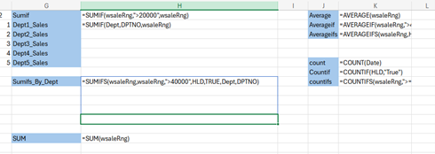
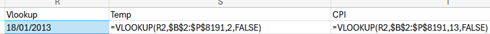
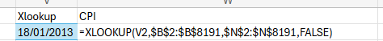
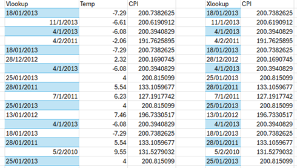
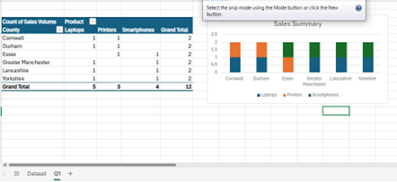
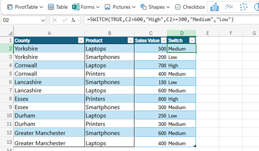
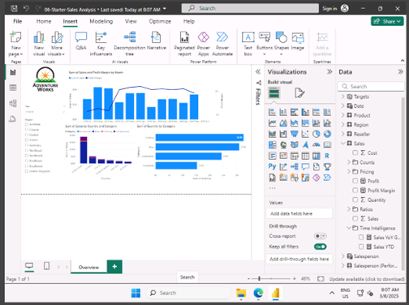
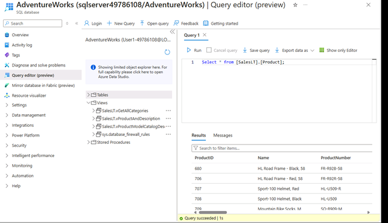
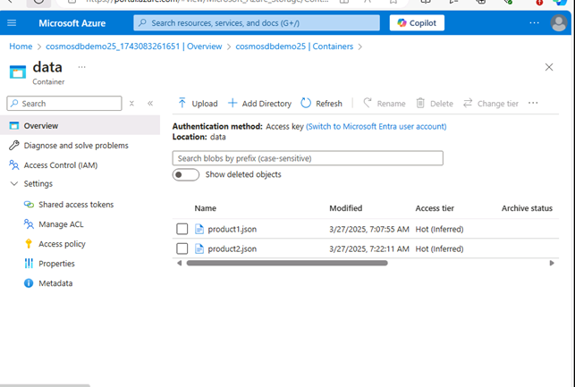
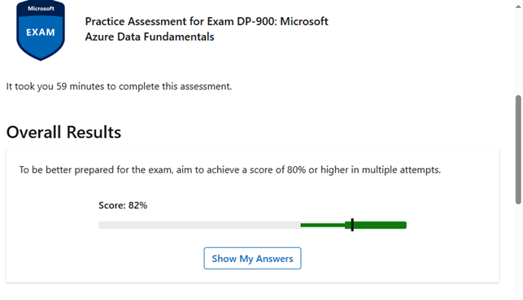

# 📚 Data Skills Bootcamp - Just IT

##  🛠️ Tools Learn

- 📊 **Excel** – Spreadsheets, formulas, pivot tables , VLOOKUP/XLOOKUP
- 📈 **Power BI** –Power Query, DAX and Data Dashboards
- 📉 **Tableau** – Visual analytics and interactive dashboards
- 🛢️ **SQL** – Structured Query Language for databases
- ☁️ **Microsoft Azure** – Cloud computing and data services
- 🐍 **Python** – Data analysis, scripting, and automation, Pandas, Matplotlib , Seaborn
---

### 🚀 Data Skills Bootcamp – Overview
- The Data Skills Bootcamp is an intensive, hands-on training program designed to build real-world data capabilities through practical exercises and project-based learning. Participants will gain experience with leading data visualization and analysis tools including Power BI, Tableau, Python, SQL, and Excel.
- Areas covered on bootcamp like what is Data/Big Data, Data cleaning, Analysis,Visualisation, interactive dashboards, Cloud Services, GDPR & Data Ethics, SQL Queries, Python Scripting.
---
## 📆💻 Weekly Training and Tools learn
#### 📘 Week 1: Excel Essentials, Data Analysis Foundations, DPA & GDPR
- Topics Covered: Data handling in Excel, key functions, PivotTables, VLOOKUP, and chart creation.
#### 📊 Week 2: Power BI & Tableau Dashboards
- Projects: Spotify Listening Trends Dashboard (Power BI) & NHS Healthcare Insights Dashboard (Tableau)
- Focus: Data visualization, interactive dashboards, storytelling with data
#### 🛢️ Week 3: Relational Databases & SQL Fundamentals
- Topics Covered: Database concepts, table relationships, writing SQL queries for data extraction, filtering, joining, and aggregation.
#### ☁️ Week 5: Introduction to Microsoft Azure for Data
- Topics Covered: Cloud computing fundamentals, data storage solutions
#### 🐍 Week 6: Python for Data Analysis & Visualization
- Topics Covered:
- Data manipulation with pandas , Data visualization using Matplotlib and Seaborn, Exploratory Data Analysis (EDA) and basic charting techniques
---
## 📊📘 Visualizations by Weekly Workbook
---
### 1. 📊 Week 1 - Excel Functions , Pivot Table , Vlookup
#### Excel functions

#### Vlookup and Xlookup formulas and output
 
 
 
 
 
#### Pivot Table and bar Chart
 
#### Switch Function
 
---
### 📈 2.Week 2 Tableau and Data Visualisation
#### Tableau Dashboard
#### PowerBI Dashboard

---
###  3. 🛢️ Week 3 Relational Database & SQL Queries
#### 🔗 SQL Joins Reference
##### ✅ **INNER JOIN**
Returns only matching rows between both tables.
```
SELECT Customers.name, Orders.product
FROM Customers
INNER JOIN Orders ON Customers.customer_id = Orders.customer_id;
```
---
##### 👈 **LEFT JOIN**
Returns all records from the left table, and matched records from the right.
```
SELECT Customers.name, Orders.product
FROM Customers
LEFT JOIN Orders ON Customers.customer_id = Orders.customer_id;
```
---
##### 👉 **RIGHT JOIN**
Returns all records from the right table, and matched records from the left.
```
SELECT Customers.name, Orders.product
FROM Customers
RIGHT JOIN Orders ON Customers.customer_id = Orders.customer_id;
```
---
##### 🔄 **FULL OUTER JOIN**
Returns all records when there is a match in either left or right table.
```
SELECT Customers.name, Orders.product
FROM Customers
FULL OUTER JOIN Orders ON Customers.customer_id = Orders.customer_id;
```
---
##### 🔁 **SELF JOIN**
Joins a table with itself. Useful for hierarchical data (e.g., employees & managers).
```
SELECT 
    e.name AS employee,
    m.name AS manager
FROM Employees e
LEFT JOIN Employees m ON e.manager_id = m.employee_id;

#### 🛠️ Implementing a Simple SQL Database – FastAndFresh
This section includes SQL code for creating a basic database with inventory, customer, and sales information.
---
##### 📦 1. Create Database
```sql
CREATE DATABASE IF NOT EXISTS FastAndFresh;
```
---
##### 🧾 2. Create Tables
###### 🗃️ Inventory Table
```sql
CREATE TABLE Inventory1 (
   productID int(4),
   ProductName varchar(1000) DEFAULT NULL,  
   UnitPrice decimal(10,2),
   Stock int(4), 
   PRIMARY KEY (productID)
);
```
###### 👥 Customer Information Table
```sql
CREATE TABLE CustomerInfo (
   CustomerID int,
   CustomerName varchar(1000) DEFAULT NULL,  
   Email varchar(200) NOT NULL,
   LoyalytPoint int, 
   PRIMARY KEY (CustomerID)
);
```
###### 🧾 Sales Table

```sql
CREATE TABLE SalesInfo (
  SalesID int,
  CustomerID int, 
  productID int,
  Quantity int NOT NULL,   
  TotalPrice int NOT NULL, 
  SalesDate Date,  
  PRIMARY KEY (SalesID),
  FOREIGN KEY (productID) REFERENCES Inventory1(productID),
  FOREIGN KEY (CustomerID) REFERENCES CustomerInfo(CustomerID)
);
```
---
###### ➕ 3. Insert Data
####### 👤 Insert into CustomerInfo

```sql
INSERT INTO CustomerInfo (CustomerId, CustomerName, Email, LoyalytPoint)
VALUES (1, 'Dan Healy', 'DanH@hotmail.com', 100);

INSERT INTO CustomerInfo (CustomerId, CustomerName, Email, LoyalytPoint)
VALUES (2, 'Indie Smat', 'IndiS@hotmail.com', 50);
```
###### 📦 Insert into Inventory1

```sql
INSERT INTO Inventory1 (productID, ProductName, UnitPrice, Stock)
VALUES (1, 'Milk', 1.50, 20);

INSERT INTO Inventory1 (productID, ProductName, UnitPrice, Stock)
VALUES (2, 'Eggs', 3.25, 100);
```
###### 🧾 Insert into SalesInfo
```sql
INSERT INTO SalesInfo (SalesID, CustomerID, productID, Quantity, TotalPrice, SalesDate)
VALUES (1, 1, 1, 2, 4, '2025-01-04');

INSERT INTO SalesInfo (SalesID, CustomerID, productID, Quantity, TotalPrice, SalesDate)
VALUES (2, 2, 2, 2, 3, '2025-01-04');
```
---
### 4. 💼 Week 4 Career Development Week (Non-Technical)
- Note:This week focused on career-building activities such as CV enhancement, interview preparation, LinkedIn optimization, and job market insights.
 No technical workbook was submitted for this week.
---
### 5. ☁️ Week 5 Cloud Storage ,Microosft Azure and Labs
☁️ What is Microsoft Azure?
Microsoft Azure is a cloud computing platform and service created by Microsoft. It provides a wide range of cloud-based solutions that allow businesses and individuals to build, manage, and deploy applications and services through Microsoft-managed data centers.
#### Azure Labs
---
##### Lab1:Explore Relation Data in Azure

---
##### Lab2: Explore Non Relation Data in Azure

---
#### Lab3: Azure DP-900 practice Exam

---
